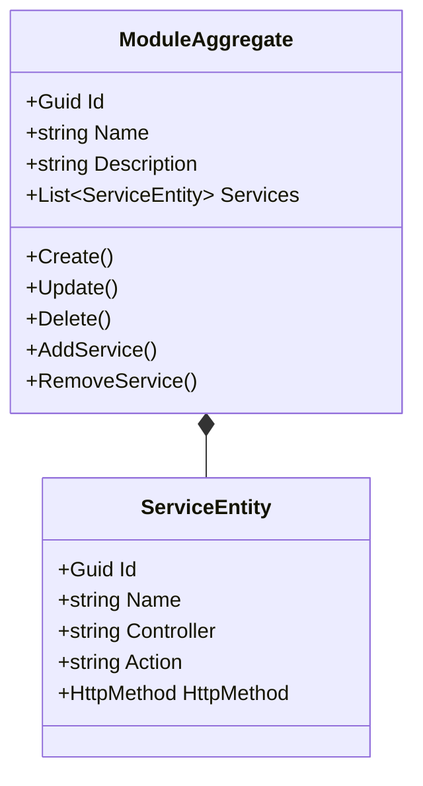
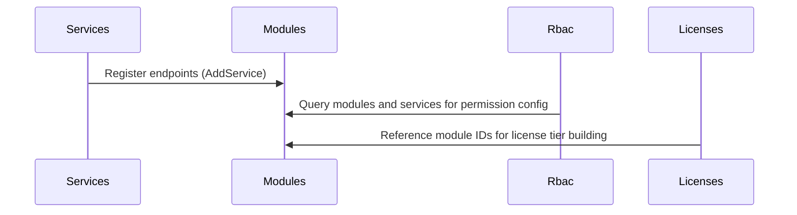

# Modules Microservice

## Overview

The Modules microservice maintains the registry of platform modules and their associated service endpoints. A module represents a logical functional area of the platform (e.g., "Parking", "CommonAreas", "Invoicing"), and each module contains a list of service entries that describe the specific controller/action/HTTP-method combinations available within that module. This registry is consumed by the RBAC system to know what resources exist, by the Licenses microservice to configure which modules a license tier includes, and by administration UIs for permission configuration.

## Business Context

In a modular SaaS platform, the set of available features is not static. New microservices are deployed, new controllers are added, and new actions become available over time. Without a central registry of what modules and services exist, the RBAC configuration UI would not know what resources to offer for permission assignment, and the license configuration UI would not know what modules are available for inclusion in a tier.

The Modules microservice solves this by acting as the single catalog of "what the platform can do." Each microservice registers its controllers and actions here (either manually or via automated discovery at startup through the Services microservice). The RBAC microservice then references these module/service entries when defining permissions. The Licenses microservice references module IDs when building license tiers.

For a new developer: think of this as the "feature catalog" of the platform. It does not enforce access -- it simply declares what features exist so that other systems (RBAC, Licenses) can reference them.

## Ubiquitous Language

| Term        | Definition                                                                                                                                       |
| ----------- | ------------------------------------------------------------------------------------------------------------------------------------------------ |
| Module      | A logical grouping of related platform functionality (e.g., "Parking", "Invoicing", "Users"). Identified by a unique ID and name.               |
| Service     | A specific API endpoint within a module, identified by its controller name, action name, and HTTP method. Represents a single permissionable unit.|
| Controller  | The name of the REST controller that exposes the service (e.g., "VehiclesController", "InvoiceController").                                      |
| Action      | The name of the specific method within a controller (e.g., "Create", "GetAll", "Delete").                                                        |
| HttpMethod  | The HTTP verb used to invoke the service: Get, Post, Put, Delete, Patch, or None.                                                                |
| Name        | The human-readable display name of a module or service, used in administration UIs.                                                              |
| Description | A textual explanation of what the module or service does, shown in configuration interfaces.                                                     |
| IsActive    | Whether the module is currently available in the platform. Inactive modules are hidden from configuration UIs.                                    |
| AddService  | The domain operation that registers a new service endpoint within a module.                                                                       |
| RemoveService | The domain operation that unregisters a service endpoint from a module.                                                                         |
| Registration| The process by which microservices declare their endpoints in the Modules catalog, either manually or via automated discovery.                    |
| Permission  | A reference from the RBAC system to a specific module/service entry that controls who can invoke it.                                              |
| License Module | A reference from the Licenses system to a module ID indicating that the module is included in a license tier.                                 |
| Feature Catalog | The collective set of all registered modules and services, representing the full capability surface of the platform.                          |
| Soft Delete | Logical removal of a module by marking it inactive without physical deletion.                                                                    |
| ServiceEntity | The entity class representing a single service endpoint, containing Id, Name, Controller, Action, and HttpMethod.                              |

## Domain Model

The Modules domain is organized around a single aggregate. The `ModuleAggregate` represents a platform module with its list of service endpoints. Services are entities embedded within the module. The aggregate enforces that service registrations have valid names, controllers, actions, and HTTP methods.

## Data Dictionary

### ModuleAggregate

The central aggregate representing a platform module.

| Field       | Type                  | Description                                            |
| ----------- | --------------------- | ------------------------------------------------------ |
| Id          | Guid                  | Unique identifier of the module                        |
| Name        | string                | Display name of the module (e.g., "Parking")           |
| Description | string                | Detailed description of the module's purpose           |
| Services    | List\<ServiceEntity\> | Collection of service endpoints within this module     |
| IsActive    | bool                  | Whether the module is currently available               |
| CreatedBy   | Guid                  | User who created the module                            |
| CreatedAt   | Instant               | UTC timestamp of creation                              |
| UpdatedBy   | Guid?                 | User who last modified the module                      |
| UpdatedAt   | Instant?              | UTC timestamp of last modification                     |

### ServiceEntity

Embedded within ModuleAggregate. Represents a single permissionable API endpoint.

| Field      | Type       | Description                                                    |
| ---------- | ---------- | -------------------------------------------------------------- |
| Id         | Guid       | Unique identifier of the service entry                         |
| Name       | string     | Human-readable name of the service                             |
| Controller | string     | Controller class name that exposes this endpoint               |
| Action     | string     | Method name within the controller                              |
| HttpMethod | HttpMethod | HTTP verb: Get, Post, Put, Delete, Patch, None                 |

### Enumerations Reference

**HttpMethod:** None, Get, Post, Put, Delete, Patch

## Integration Architecture

Modules serves as a reference catalog consumed by RBAC and Licenses. It does not consume events from other microservices. The Services microservice registers endpoints here via gRPC or internal calls. RBAC queries module/service data to build permission configurations.

## Event Catalog

### Events Produced

| Event                        | Trigger                       | Purpose                                         |
| ---------------------------- | ----------------------------- | ----------------------------------------------- |
| `ModuleCreatedDomainEvent`   | `ModuleAggregate.Create()`    | Notifies that a new module was registered       |
| `ModuleUpdatedDomainEvent`   | `ModuleAggregate.Update()`    | Notifies that a module was modified             |
| `ModuleDeletedDomainEvent`   | `ModuleAggregate.Delete()`    | Notifies that a module was soft-deleted         |
| `ServiceAddedDomainEvent`    | `ModuleAggregate.AddService()`| Notifies that a service was added to a module   |
| `ServiceRemovedDomainEvent`  | `ModuleAggregate.RemoveService()`| Notifies that a service was removed          |

## API Reference

Base path: `/api`

### Modules

| Method | Path                                    | Description                                          | Auth    |
| ------ | --------------------------------------- | ---------------------------------------------------- | ------- |
| GET    | `/api/Module`                           | Paginated list of modules (supports Criteria)        | Bearer  |
| GET    | `/api/Module/{id}`                      | Get a module by ID with its services                 | Bearer  |
| POST   | `/api/Module`                           | Create a new module                                  | Bearer  |
| POST   | `/api/Module/{id}/service`              | Add a service endpoint to a module                   | Bearer  |
| PUT    | `/api/Module/{id}`                      | Update a module                                      | Bearer  |
| DELETE | `/api/Module/{id}`                      | Soft-delete a module                                 | Bearer  |
| DELETE | `/api/Module/{id}/service/{serviceId}`  | Remove a service from a module                       | Bearer  |

All endpoints return RFC 7807 Problem Details on error. List responses use `Pagination<T>`.

## Key Design Decisions

- **Module as aggregate with embedded services:** Services are entities within the module aggregate rather than separate aggregates. This ensures that all service registrations for a module are managed atomically and that the module controls its own consistency.

- **HttpMethod validation:** The domain guard rejects services with `HttpMethod.None`, ensuring every registered endpoint has a valid HTTP verb for RBAC matching.

- **Idempotent service addition:** Adding a service that already exists (by name) is a no-op rather than an error, supporting automated re-registration at microservice startup.

- **No tenant scoping:** Modules are global platform resources, not tenant-specific. All tenants share the same module catalog; access control is handled by Licenses and RBAC.

- **Separation from Services microservice:** Modules defines logical groupings while Services defines physical microservice endpoints. A module can span multiple microservices.

## Related Microservices

| Microservice | Direction | Integration Point                                                          |
| ------------ | --------- | -------------------------------------------------------------------------- |
| Services     | Inbound   | Registers discovered endpoints as services within modules                  |
| Rbac         | Outbound  | RBAC references module/service IDs when configuring permissions            |
| Licenses     | Outbound  | License tiers reference module IDs to define what is included in each plan |
